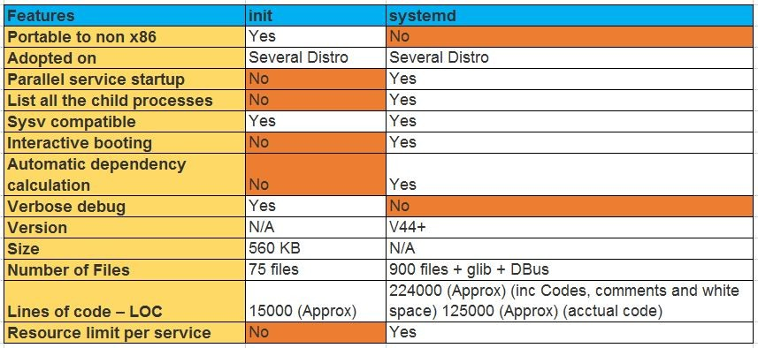
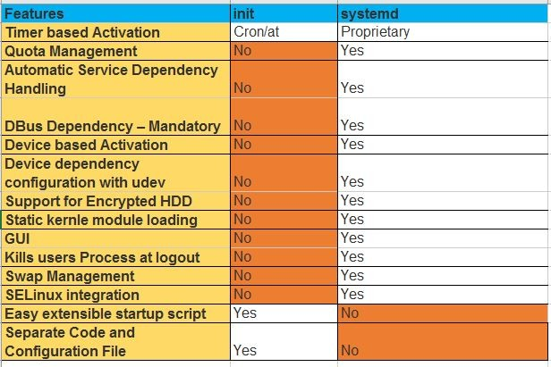

# Linux Level-2 Questions
---

        1. Please explain Linux booting processing? 

        2. Difference between RHEL6 and RHEL7 booting process.

        3. Difference between systemd and initd.
           Hint =>
                "Systemd" is an enhanced version of "init". "sysytemd" was launched with RHEL 7.x has capability
                to start the services in parallel. Please refer to below table for more information. 
  |  

        4. What are the inodes and how will you free up them?

        5. How to check the loaded kernel modules.
           Hint =>
               using "lsmod" command

        6. How to load kernel module. any commands ?
            Hint =>
                        We can use "modprobe" or "insmod" commands to load kernel module.

        7. How to blacklist a module.

        8. Explain the below error:

                -------------------------------------------------------------------------------------------
                 No filesystem could mount root, tried:
                [    4.471120] Kernel panic - not syncing: VFS: Unable to mount root fs on unknown-block(0,0)
                -------------------------------------------------------------------------------------------

        9. Explain few examples of kernel panic.
            Hint =>
               A kernel panic is one of several Linux boot issues. In basic terms, it is a situation when the kernel
               can't load properly and therefore the system fails to boot. During the boot process, the kernel does
               not load directly. Instead, initramfs loads in RAM, then it points to the kernel (vmlinuz), and then
               the operating system boots. If initramfs gets corrupted or deleted at this stage because of recent 
               OS patching, updates, or other causes, then we face a kernel panic.
    
               Causes of Kernel panics:
                 a). If the initramfs file gets corrupted.
                 b). If initramfs is not created properly for the specified kernel. Every kernel version has its own
                     corresponding initramfs.
                 c). If the installed kernel is not supported or not installed correctly.
                 d). If recent patches have some flaws.
                 e). If a module has been installed from online or another source, but the initrd image is not 
                     created with the latest installed module.

        10. What is an oops in terms of Kernel?
           Hint =>
               An oops indicates a kernel bug and should always be reported and fixed.
               When an oops occurs, the system will print out information that is relevent to debugging the problem,
               like the contents of all the CPU registers, and the location of page descriptor tables.
               In particular, the contents of the EIP (instruction pointer) is printed. Like this:

                   EIP: 0010:[<00000000>]
                   Call Trace: [<c010b860>]

               An oops is not a kernel panic. In a panic, the kernel cannot continue; the system grinds to a halt and
               must be restarted. An oops may cause a panic if a vital part of the system is destroyed. An oops in a 
               device driver, for example, will almost never cause a panic.

         11. What is "nohup" used for?
             Hint =>
                 nohup is a POSIX command which means "no hang up". Its purpose is to execute a command such that it
                 ignores the HUP (hangup) signal and therefore does not stop when the user logs out. Output that 
                 would normally go to the terminal goes to a file called nohup.

                 ## nuhup Syntax:
                        nohup command [command-argument ...]

         12. How to troubleshoot a issue where a client not able to access a server?

         13. What are outputs when you execute the NATCAT (nc) command  and explain each ?
             Hint =>
                - Connected
                - Connection timeout
                - Connection refused(if port / server is blocking by the firewall)

         14. How can we check the packet flow in our system?
             Hint => 
                 We can use "tcpdump" command to check the incoming and outgoing packets.

         15. what is the steal value in top command?

         16. What is tcpwrappers?
             Hint =>
                tcpwrappers is a host based Network Access Control List, by which we can allow or deny a host or
                subnetwork IP addresses. Files used by tcpwrappr for access control are /etc/hosts.allow and 
                /etc/hosts.deny.

         17. Describe how 'ps' works.
            Hint =>
               On Linux, the ps command works by reading files in the proc filesystem. The directory '/proc/PID'
               contains various files that provide information about process PID. The content of these files is
               generated on the fly by the kernel when a process reads them.
               You can use 'strace' command to actually see how ps works. 
    
         18. Which Linux file types do you know?

         19. What is "nohup" used for?

         20. What is the difference between these two commands?  myvar=hello & export myvar=hello

         21. What happens to a child process that dies and has no parent process to wait for it and what’s bad about this?

         22. Explain briefly each one of the process states.

         23. How to know which process listens on a specific port?

         24. What is a zombie process and what could be the cause of it?

         25. You run a bash script and you want to see its output on your terminal and save it to a file at the same time.
             How can you achieve it?
             Hint => 
                We can use "tee" command to do this. Below is the command expamle: 
             
                /sbin/ifconfig | tee FILE_NAME

         26. Explain what echo "1" > /proc/sys/net/ipv4/ip_forward does.

         27. What is CPU load ? How to calculate the load average on the system? 

         28. What the Zombie and Orphan process? How to kill zombie process?

         29. What could be the impacts on the system if there are many zombie process are available? 

         30. Explain the TOP, IOSTAT,VMSTAT,IOTOP commands. 

         31. You need to upgrade kernel at 100-1000 servers, how you would do this?

         32. How can you tell if the httpd package was already installed?

         33. How can you list the contents of a package?

         34. How can you determine which package is better: openssh-server-5.3p1-118.1.el6_8.x86_64 or
             openssh-server-6.6p1-1.el6.x86_64 ?

         35. Describe briefly the steps you need to take in order to create and install a valid certificate for the site
             https://www.nightwolf.in.

         36. Can you have several HTTPS virtual hosts sharing the same IP?

         37. What is a wildcard certificate?

         38. Which Linux file types do you know?

         39. How can you get Host, Channel, ID, LUN of SCSI disk?

         40. Can you explain to me the difference between block based, and object based storage?

         41. What is a tarpipe (or, how would you go about copying everything, including hardlinks and special files,
             from one server to another)?

         42. How many NTP servers would you configure in your local ntp.conf?

         43. What does the column 'reach' mean in ntpq -p output?

         44. What is bash quick substitution/caret replace(^x^y)?

         45. Do you know of any alternative shells? If so, have you used any?

         46. How can you limit process memory usage?

         47. How do you troubleshoot memory performance issue. Please explain the details.

         48. Which tools do you use to troubleshoot high Memory troubleshooting.

         49. What are zombie process and how to kill/reclaim them.

         50. What are D-State processes and what causes these.

         51. If Disk is causing D-state processes, what you can check and can do to fix the issue.

         52. How to troubleshoot the system performance if any Linux system is facing slowness? 

         53. How to troubleshoot high memory usageissue on Linux system.

